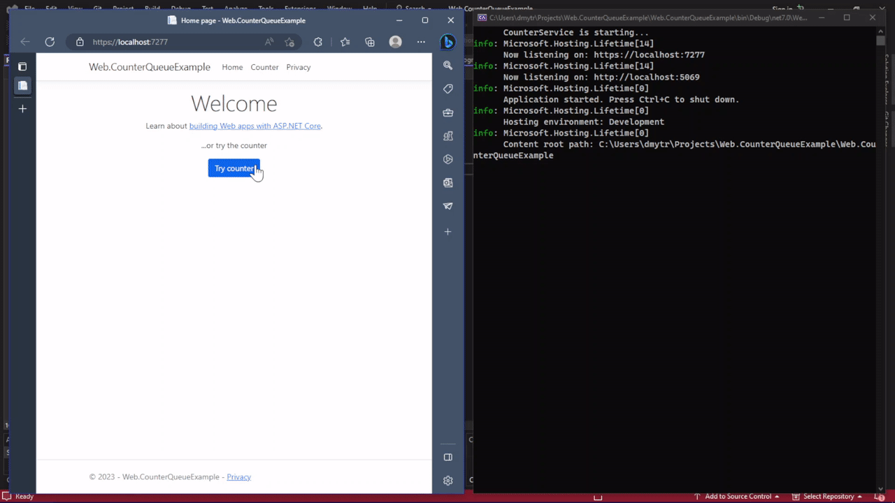

# Web.CounterQueueExample

This repository contains example implementation of
queue background service with defined operations.

Service performes enqueued operations with specific
time interval and the length of queue is constrained.

